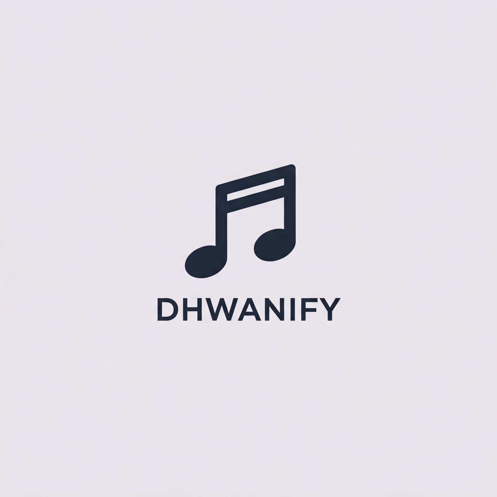

# Dhwanify

A lightweight, open-source music player built with Electron and React, featuring local playback, music organization and downloading capabilities as well as audio visualization features. Created for FOSS Hack 2025.

## Features

- Local audio file playback with modern UI
- Folder and Tracklist level music organization
- Music downloading via SpotDL integration (automatic metadata tagging, playlist download, etc!)
- Real-time audio visualization
- Secure Electron architecture

## Screenshots

## Installation

NOTE: Dhwanify is UNTESTED on Unix/Linux/macOS.

```bash
# Clone the repository
git clone https://github.com/titanite07/dhwanify.git
cd dhwanify

# Install Node dependencies
npm install

# Set up Python environment
cd backend
python -m venv venv

# Activate virtual environment (Windows)
.\venv\Scripts\activate

# For Unix/Linux/macOS use:
# source venv/bin/activate

# Install Python dependencies
pip install -r requirements.txt

# Return to root directory
cd ..
```

## Usage

```bash
# Development mode
npm run dev

# Build application (DOESN'T QUITE WORK JUST YET)
npm run build

# Package for distribution (DOESN'T QUITE WORK JUST YET)
npm run package
```

## Development Requirements

- Node.js 18+
- npm 9+
- Python 3.8+ (for SpotDL)

## Tech Stack

- Electron 34.2.0
- React 19.0.0
- TypeScript 5.7.2
- Express 4.21.2
- Vite 6.1.0

## Planned Features

- Additional Visualizer styles
- Custom theme support

## License

MIT License
